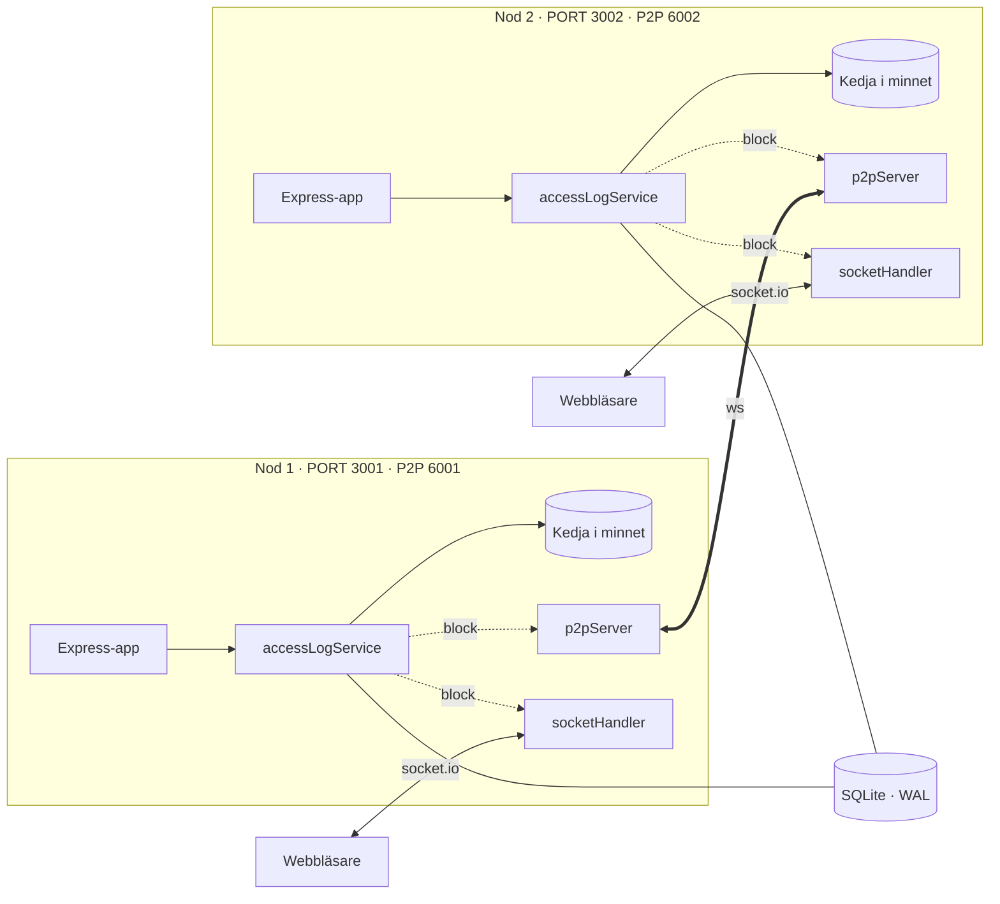
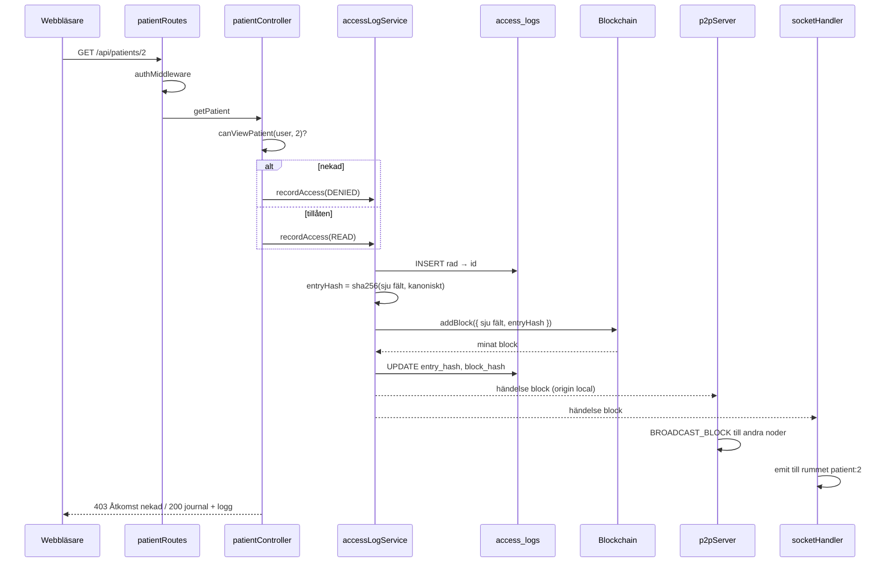
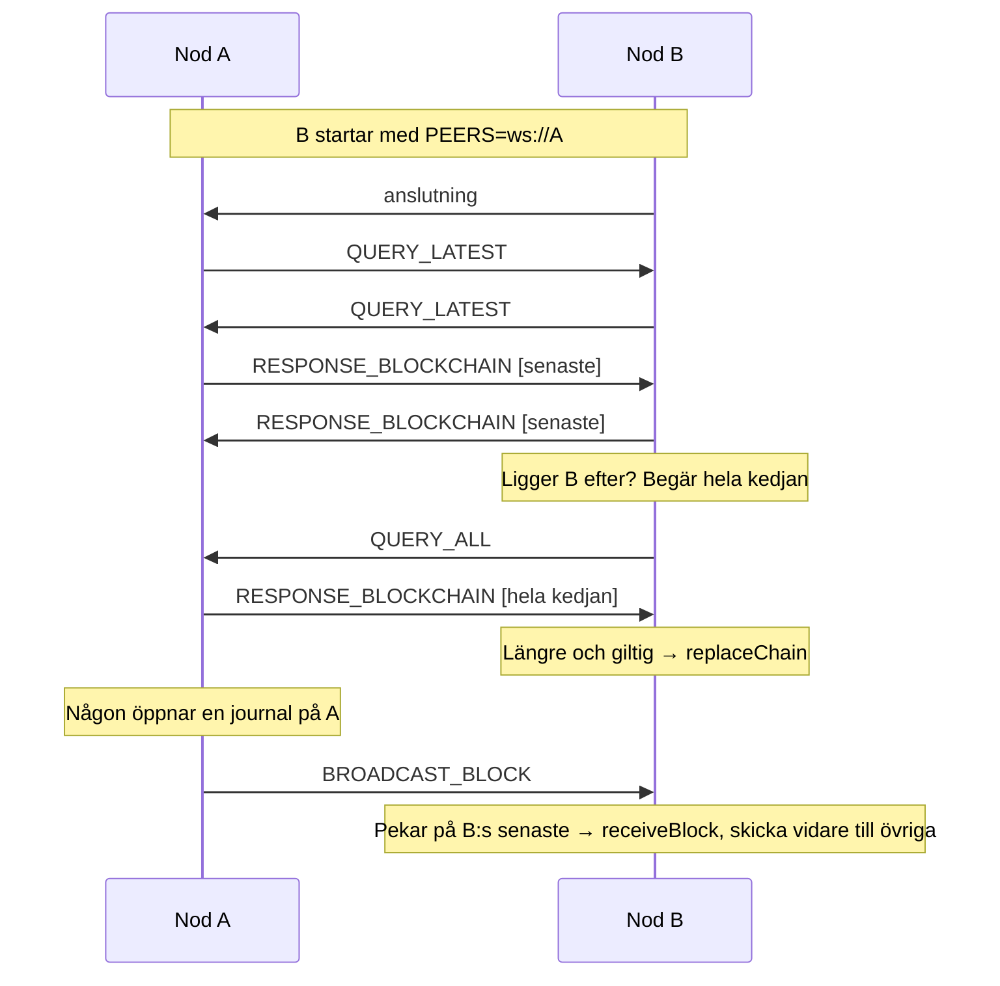
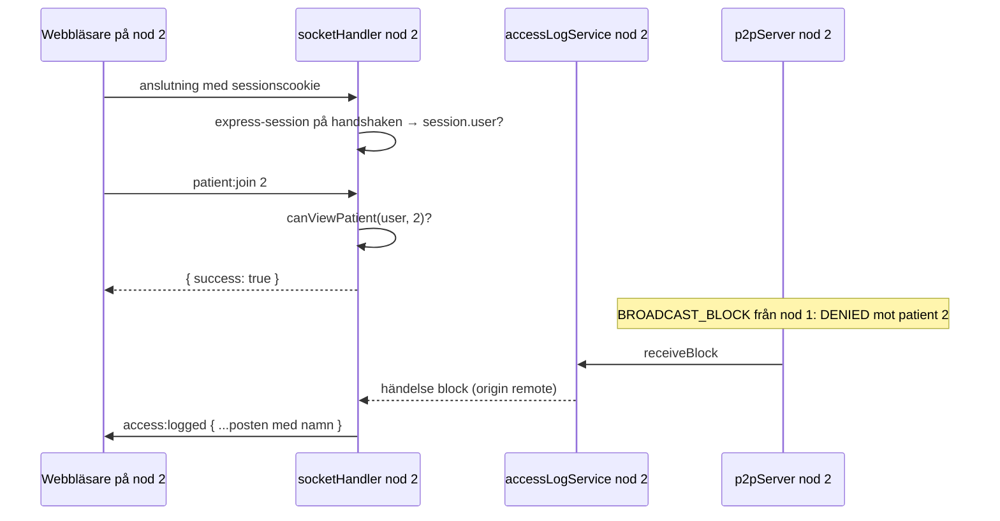

# Arkitektur

Beskriver hur delarna i `patientjournal-blockchain/` hänger ihop och varför de ser ut som de gör. Installation, API och databasschema finns i [README](../README.md).

## Översikt

Två likadana noder kör samma kod med olika miljövariabler. Varje nod har en Express-app med API och frontend, en socket.io-server för realtid till webbläsarna, en WebSocket-server och -klient för P2P mot den andra noden, och en egen kopia av blockkedjan i minnet. Databasen delas.



Heldragna linjer är anrop, streckade är händelsen `block` som liggaren skickar när ett block lagts till.

## Lager

Flödet är routes → controllers → services → models, och ingen går förbi ett lager.

| Lager | Ansvar | Känner till |
|---|---|---|
| `routes/` | Vilken URL som leder vart, och vilka middleware som körs först | controllers, middleware |
| `controllers/` | HTTP in och ut: läser `req`, väljer statuskod, bygger svaret. Avgör när något ska loggas som `READ`, `WRITE` eller `DENIED`. | services |
| `services/` | Reglerna: behörighet, validering, liggaren, inloggning | models, blockchain |
| `models/` | SQL mot en tabell var. Döper om kolumner till camelCase redan i frågan. | databasen |
| `blockchain/` | Block, kedja, proof of work, hashning, kedjefil. Vet ingenting om patienter eller databasen. | bara sig själv |
| `p2p/` | Nätverk: WebSocket mellan noder, socket.io till webbläsare. Lyssnar på liggaren, anropar den vid mottagna block. | accessLogService, accessControl |

Två befintliga middleware används som de är. `authMiddleware` kräver `req.session.user` och sätter `req.user`. `roleMiddleware(...roller)` ger 403 för fel roll och används för sökningen, där nekandet inte gäller någon särskild patient. För journalen och anteckningarna görs rollkontrollen i stället i controllern, eftersom ett nekat försök där ska loggas som `DENIED` mot just den patienten.

## Liggaren, systemets kärna

`accessLogService` är den enda modulen som äger kedjan. Allt som rör kedjan går via den.



Varför en händelse i stället för att liggaren anropar P2P och socket.io direkt: liggaren blir testbar utan nätverk, P2P och socket.io kan läggas till och tas bort oberoende av varandra, och ett block som kommit utifrån via `receiveBlock` ger exakt samma händelse som ett eget block. Det är det som gör att en webbläsare på nod 2 får veta vad som hände på nod 1.

### De sju fälten

Hashen beräknas över exakt `id`, `patientId`, `userId`, `role`, `action`, `noteId` och `timestamp`, ingenting annat. Namn, personnummer och journaltext ligger utanför, så kedjan kan läsas av vem som helst utan att röja något utöver att användare 4 nekades åtkomst till patient 2 vid en viss tidpunkt. Samtidigt är de sju fälten tillräckliga för att varje ändring av en rad ska synas: byts användare, roll, åtgärd, patient, anteckning eller tidpunkt stämmer hashen inte längre.

### Kanonisk serialisering

`JSON.stringify` behåller den ordning fälten råkar ha skapats i. En rad läst från databasen och samma rad återskapad från ett block på en annan nod kan få olika ordning och därmed olika strängar, trots samma innehåll. `canonicalStringify` sorterar nycklarna alfabetiskt, rekursivt, och behandlar `undefined` som `JSON.stringify` gör, så att ett block som gått genom JSON över nätet hashas identiskt med originalet.

### Statisk hashberäkning

Block som kommer från en annan nod är vanliga JSON-objekt utan metoder. `Block.computeHash(obj)` är därför statisk och tar vilket objekt som helst med rätt fält. Samma funktion används för egna block, för mottagna block och för validering av hela kedjor.

### Ett block per åtkomst

Varje åtkomst blir ett eget block direkt, utan transaktionspool eller samlad mining. Det gör att en loggpost är säkrad i kedjan i samma ögonblick som svaret skickas, och att realtidshändelsen kan bära ett färdigt block. Priset är att två noder kan skapa block med samma index samtidigt, vilket forkhanteringen tar hand om.

### Verifiering i två steg

Hasharna avslöjar ändrade rader men inte raderade. Tas en rad bort helt stämmer fortfarande alla rader som finns kvar. Därför jämför `verifyAll` också kedjans poster mot databasens rader, id för id, och rapporterar `missingRows`. Det är precis scenariot med någon som raderar serverloggar för att dölja ett intrång.

## P2P



Reglerna för ett mottaget block, i ordning:

1. Index lägre än eller lika med vårt senaste: ignorera.
2. Pekar på vårt senaste: `receiveBlock`. Skicka vidare till övriga noder bara om det lades till, annars studsar blocket mellan noderna för evigt.
3. Ett ensamt block som inte passar: begär hela kedjan av avsändaren.
4. En hel kedja: `replaceChain`, som byter bara om den är längre och giltig.

Genesis-blocket har fast tidsstämpel. Hade varje nod skapat genesis med `Date.now()` hade noderna haft olika kedjor från start och aldrig kunnat enas.

### Fork

```
          A minar block 2a            B minar block 2b, sedan 3b
A:  G - 1 - 2a                   B:  G - 1 - 2b - 3b

Anslutningen återupprättas. A får 3b, det passar inte, A begär hela kedjan.
B:s kedja är längre och giltig, A byter. Posten i 2a saknas nu i A:s kedja.
A minar om den ovanpå den nya kedjan och skickar blocket till B.

A:  G - 1 - 2b - 3b - 4(2a)       B:  G - 1 - 2b - 3b - 4(2a)
```

`replaceChain` i liggaren jämför posternas `entryHash` före och efter bytet. De som saknas minas om i ursprunglig ordning, raden i databasen får det nya blockets hash, och varje omminerat block skickas ut som ett vanligt eget block. Ingen åtkomst tappas, den byter bara plats.

### Återanslutning

Varje adress i `PEERS` har en egen återanslutningstimer. Bryts anslutningen, eller går den inte att öppna, görs ett nytt försök efter tre sekunder, tills noden stoppas. Startordningen spelar därför ingen roll, och noderna kan startas samtidigt.

## Realtid



Sessionen kontrolleras i handshaken genom att samma express-session-middleware körs på handshake-anropet. Rummet `patient:<id>` släpper bara in den som får se patienten, samma `canViewPatient` som API:et använder. Gränssnittet är aldrig den enda spärren.

Två skilda händelser är det som hindrar en oändlig loop. Varje hämtning av journalen loggas som en läsning, och loggas en läsning skickas en händelse. Om händelsen fick klienten att hämta om journalen skulle hämtningen skapa en ny läsning, som skapade en ny händelse, och så vidare. Därför:

- `WRITE` → `journal:updated`. Något i journalens innehåll har ändrats, klienten hämtar om.
- `READ` och `DENIED` → `access:logged` med själva posten. Klienten lägger till den i listan utan att hämta något.

Posten som skickas är raden från databasen, med namn och tidpunkt. Noderna delar databas, så även ett block som kommit från den andra noden kan slås upp lokalt.

## Databasen delas, kedjan replikeras

Två saker ligger på olika ställen med flit.

**Databasen** är en SQLite-fil som båda noderna öppnar i WAL-läge. Den innehåller patienter, användare, anteckningar och den läsbara liggaren. Det är här journaltexten finns, och det är den som visas för användarna.

**Kedjan** finns i minnet på varje nod och replikeras över P2P. Den innehåller bara id-nummer och hashar. Det är den som gör liggaren kontrollerbar: en rad som ändrats eller raderats i databasen stämmer inte längre mot kedjan.

Varje nod sparar sin kedja i `data/chain-<P2P_PORT>.json` efter varje nytt block och läser in den vid start, om filen finns och kedjan är giltig. När databasen seedas från tomt tas gamla kedjefiler bort, eftersom de då skulle peka på rader som inte finns. Startar bara en nod om hämtar den dessutom kedjan från den andra noden.

Två noder som startas samtidigt mot en tom databas hanteras: seeden tar skrivlåset direkt så att den andra noden väntar och sedan ser att data redan finns, och bytet till WAL görs om vid `SQLITE_BUSY`, som SQLite ger direkt när två anslutningar vill byta journalläge samtidigt.

## Testbarhet

Modulerna är skrivna så att de kan testas utan nätverk och utan filsystem.

- `NODE_ENV=test` ger databas i minnet, svårighetsgrad 1, lägre scrypt-kostnad och ingen kedjefil.
- `app.js` exporterar Express-appen utan att lyssna på en port, så supertest kör den direkt.
- `createP2PServer` och `createSocketHandler` är fabriker som tar liggaren som parameter. P2P-testerna kör två eller tre riktiga noder i samma process på lediga portar, var och en med egna moduler via `jest.isolateModules`, och provar bland annat ett äkta forkscenario.
- Liggaren skickar händelser i stället för att anropa nätverket, så den testas för sig.

## Säkerhet i korthet

- Behörighet avgörs på servern, i `accessControl.js`, för både API och socket.io.
- Nekade försök loggas som `DENIED` mot den patient försöket gällde, så en patient ser i sin egen logg om någon försökt nå hens journal.
- Lösenord hashas med scrypt och eget salt per användare, jämförelse med `timingSafeEqual`.
- Sessionscookien är `httpOnly` och `sameSite: lax`.
- Kedjan innehåller inga personuppgifter utöver id-nummer, och kan därför läsas öppet.
- Loggrader har inga `ON DELETE`-regler och fälten som hashas skyddas av främmande nycklar, så en rad kan inte ändras i det tysta av att något annat tas bort.
